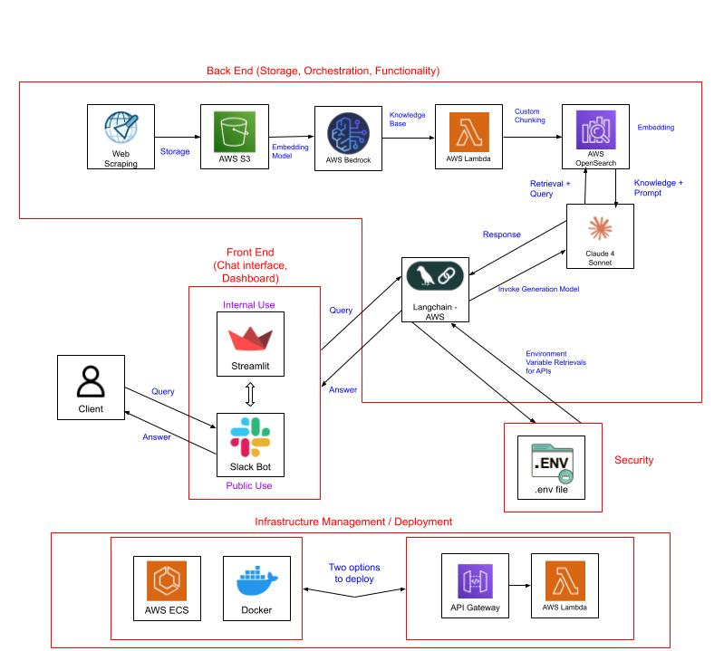
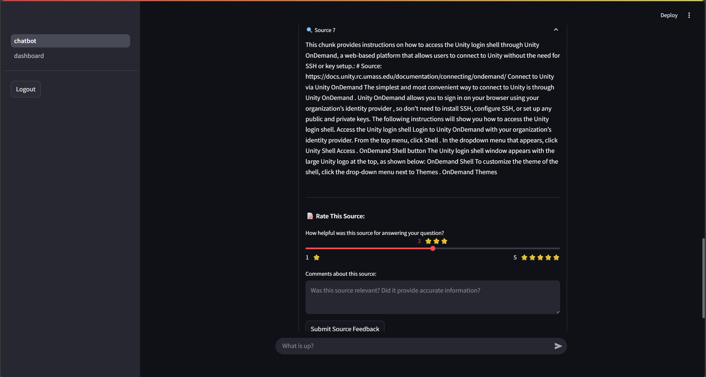

# 🧠 Unity RAG Chatbot

an AI-powered support system for Unity HPC(High Performance Computing) and AI Platform managed by [MGHPCC](https://www.mghpcc.org/)(Massachusetts Green High Performance Computing Centre), meant to answer questions based on [Unity HPC documentation](https://docs.unity.rc.umass.edu/) with multi-platform interfaces: streamlit chatbot website with an admin dashboard, meant for debugging purposes, managing when the documentation was last scraped, and a slack bot.

## 📋 Table of Contents

- [🎯 Overview](#-overview)
- [🏗️ Architecture](#️-architecture)
- [📸 Screenshots](#-screenshots)
- [🚀 Quick Start](#-quick-start)
- [📂 Project Structure](#-project-structure)
- [🏗️ Deployment](#️-deployment)

## 🎯 Overview

### Key Features
- **Multi-Platform Support**: Web interface (Streamlit) + Slack bot integration
- **RAG Architecture**: AWS Bedrock + Claude 4.0 Sonnet with knowledge base retrieval
- **Automated Data Pipeline**: Documentation scraping and Slack conversation analysis
- **Analytics Dashboard**: User feedback tracking and data pipeline management as well as keeping track of additional q&A pairs for the bot
- **Production Ready**: AWS ECS deployment with CI/CD pipeline

### Technology Stack
- **AI/ML**: AWS Bedrock, Claude 4.0 Sonnet, LangChain
- **Frontend**: Streamlit, Python
- **Backend**: Python, Slack Bolt SDK
- **Cloud**: AWS (S3, ECS, ALB, CloudFormation, Bedrock)
- **DevOps**: Docker, GitHub Actions

## 🏗️ Architecture



## 📸 Screenshots

### Web Interface




### Admin Dashboard


### Slack Bot Integration


## 🚀 Quick Start

### Prerequisites
- AWS account with S3 bucket and Bedrock Knowledge Base
- Docker Desktop (for Docker setup) or Python 4.0+ (for local setup)
- Slack app with bot tokens (for Slack integration)

### Environment Setup
```bash
cp .env.example .env
# Fill in your AWS credentials, knowledge base ID, S3 bucket details
```

### Option 1: Docker (Recommended)
```bash
# Build and run Streamlit chatbot
docker build -f Dockerfiles/chatbot_dockerfile -t unity-chatbot .
docker run -p 8501:8501 --env-file .env unity-chatbot

# Build and run Slack bot
docker build -f Dockerfiles/slackbot_dockerfile -t unity-slackbot .
docker run --env-file .env unity-slackbot
```

### Option 2: Local Development
```bash
# Setup virtual environment
python -m venv .venv
source .venv/bin/activate  # Linux/Mac
# .venv\Scripts\activate  # Windows

# Install dependencies
pip install -r requirements.txt

# Run applications
streamlit run chatbot.py        # Web interface
python slack_scripts/slack_bot.py             # Slack bot
```

Access the web interface at `http://localhost:8501/`

## 📂 Project Structure

For detailed project structure and file descriptions, see [docs/structure.md](docs/structure.md).

## 🏗️ Deployment

The applications can be automatically deployed to AWS using GitHub Actions workflows and CloudFormation templates. For complete deployment instructions, see [docs/README-DEPLOYMENT.md](docs/README-DEPLOYMENT.md).
