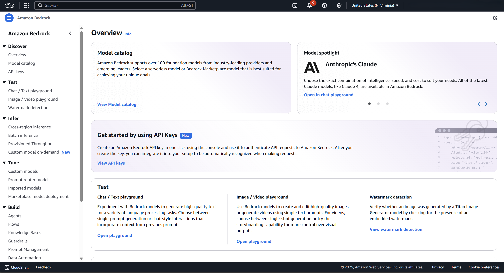
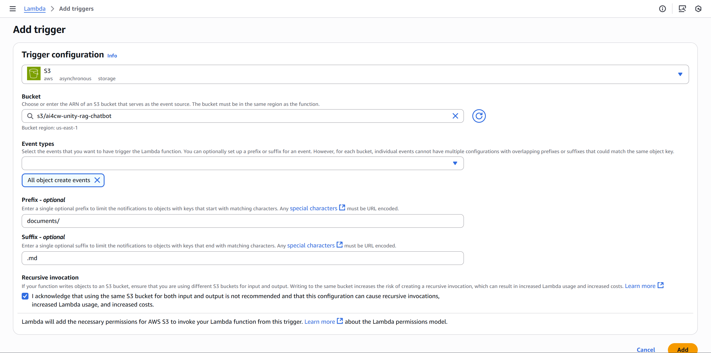
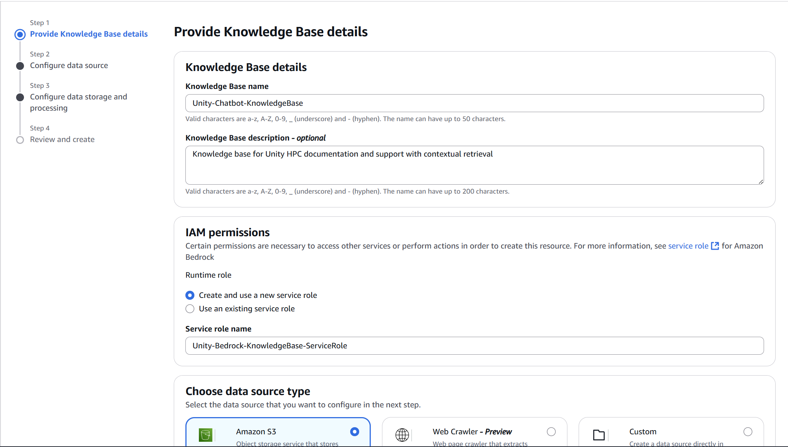
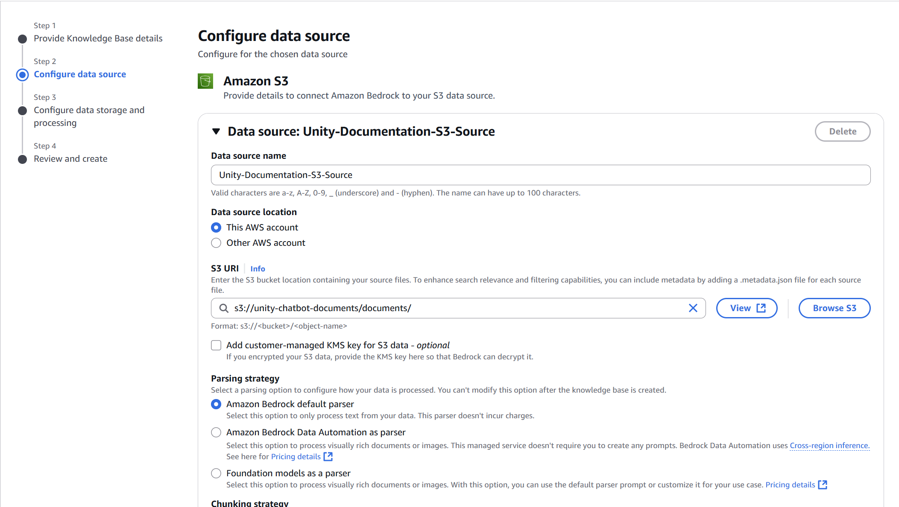
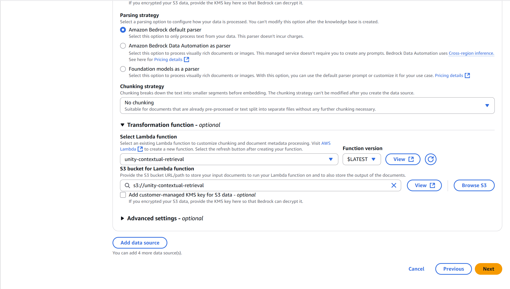
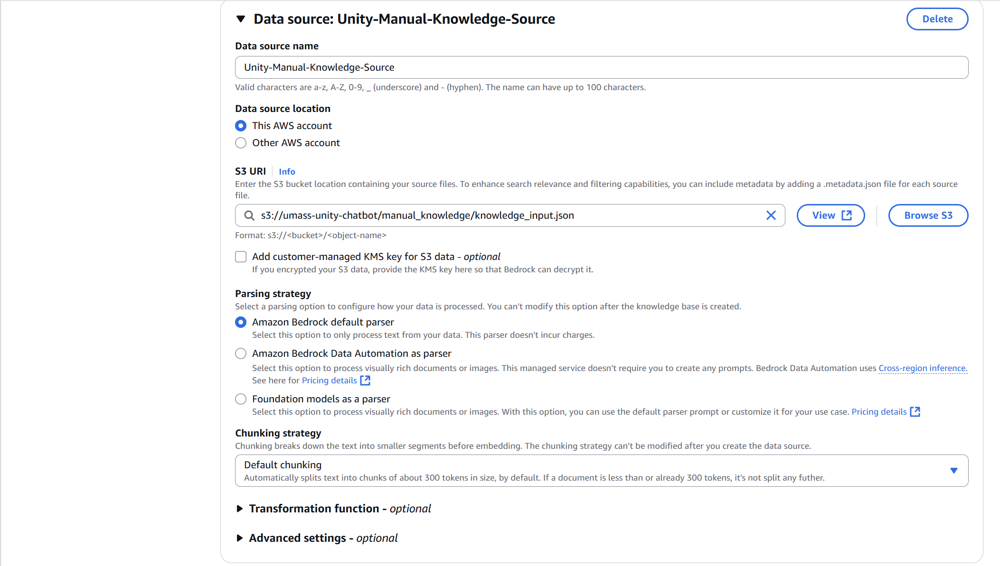
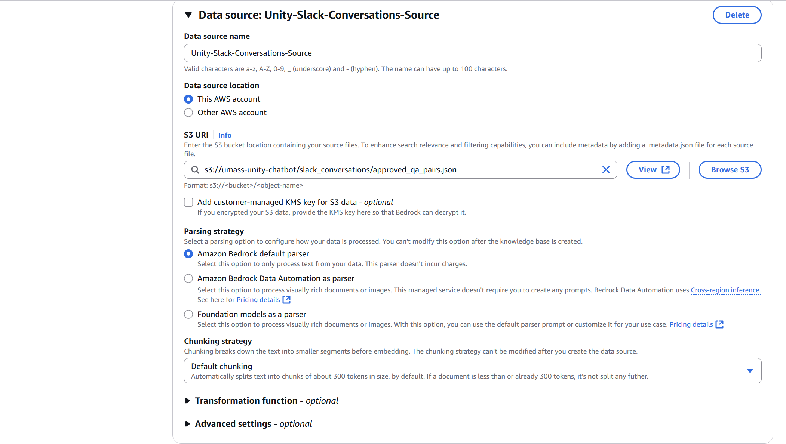
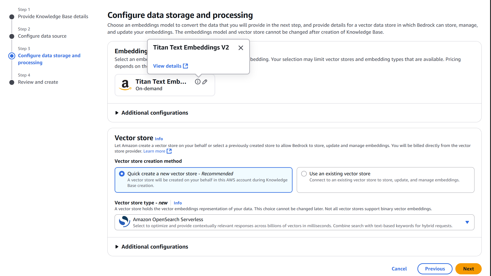
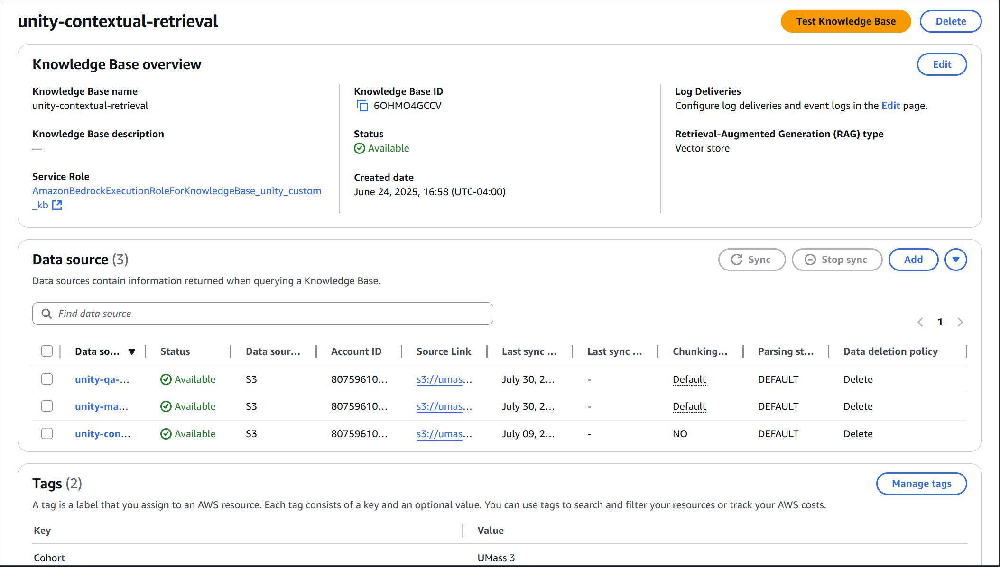

# 🧠 Knowledge Base Setup Guide

This guide walks you through setting up the AWS Bedrock Knowledge Base for the Unity RAG Chatbot system, including document ingestion with Metadata Filtering and Contextual Retrieval methods, vector embeddings, and automated data pipeline configuration.

## 📋 Table of Contents

- [🎯 Overview](#-overview)
- [📋 Prerequisites](#-prerequisites)
- [🖥️ Setup via AWS Console](#️-manual-setup-via-aws-console)
- [📊 S3 Data Source Configuration](#-s3-data-source-configuration)
- [🔄 Automated Data Pipeline Setup](#-automated-data-pipeline-setup)
- [✅ Testing Your Knowledge Base](#-testing-your-knowledge-base)
- [🔧 Troubleshooting](#-troubleshooting)

## 🎯 Overview

The Knowledge Base system consists of several key components working together to provide intelligent document retrieval:

- **AWS Bedrock Knowledge Base**: Vector database for document retrieval with enhanced contextual understanding
- **S3 Document Storage**: Centralized document repository with automatic metadata generation
- **Metadata Filtering Lambda**: Automated process for generating structured metadata using AI
- **Documentation Scraper Lambda**: Automated content ingestion from Unity documentation
- **Contextual Retrieval Lambda**: AI-powered enhancement of document chunks with contextual information before each chunk
- **Intermediate S3 Bucket**: Temporary storage for contextual retrieval processing
- **Embedding Model**: Text-to-vector conversion using Amazon Titan v2
- **OpenSearch Serverless Vector Search**: Semantic similarity matching for user queries

### Knowledge Base Architecture

```
Unity Documentation → Scraper Lambda → S3 Bucket → Metadata Filtering Lambda → Knowledge Base Data Source
                                                                                        ↓
User Query → Knowledge Base → Contextual Retrieval Lambda ← Intermediate S3 Bucket ← Processing
                 ↓
            Vector Embeddings → OpenSearch Serverless → Enhanced Results
```

### Data Processing Flow

1. **Document Upload**: Documents are uploaded to the main S3 bucket
2. **Metadata Generation**: Metadata Filtering Lambda automatically generates structured metadata
3. **Knowledge Base Ingestion**: Documents with metadata are ingested into the knowledge base
4. **Contextual Enhancement**: Contextual Retrieval Lambda enhances chunks with relevant context
5. **Vector Storage**: Enhanced chunks are converted to embeddings and stored in OpenSearch
6. **Query Processing**: User queries retrieve the most relevant enhanced content

### ⚠️ Critical Setup Order

**IMPORTANT**: Follow this exact order for proper system functionality:

1. **First**: Deploy Metadata Filtering Lambda and configure S3 triggers
2. **Second**: Upload documents to S3 (metadata will be generated automatically)
3. **Third**: Deploy Contextual Retrieval Lambda and configure Knowledge Base
4. **Fourth**: Create Knowledge Base data source with contextual retrieval configuration
5. **Fifth**: Sync data sources to start ingestion jobs to process documents

## 📋 Prerequisites

Before setting up the Knowledge Base, ensure you have:

- [ ] **AWS Account** with appropriate permissions
- [ ] **Bedrock Model Access** enabled for:
  - `amazon.titan-embed-text-v2:0` (for embeddings)
  - `anthropic.claude-sonnet-4-20250514-v1:0` (for generation)
  - `anthropic.claude-3-haiku-20240307-v1:0` (in lambda functions)
- [ ] **S3 Buckets** created for document storage
- [ ] **IAM Permissions** for Bedrock, S3, and Lambda services

### Required AWS Permissions

Your AWS user/role needs the following permissions:

```json
{
  "Version": "2012-10-17",
  "Statement": [
    {
      "Effect": "Allow",
      "Action": [
        "bedrock:*",
        "s3:*",
        "lambda:*",
        "aoss:*",
        "iam:PassRole",
        "iam:CreateRole",
        "iam:AttachRolePolicy",
        "iam:ListInstanceProfilesForRole",
        "iam:DeletePolicyVersion",
        "iam:GetRole",
        "iam:DetachRolePolicy", 
        "iam:ListAttachedRolePolicies",
        "iam:CreatePolicy", 
        "iam:GetPolicy", 
        "iam:PutRolePolicy", 
        "iam:GetRolePolicy"
      ],
      "Resource": "*"
    }
  ]
}
```

## 🖥️ Manual Setup via AWS Console

Follow this comprehensive guide to set up your Knowledge Base using the AWS Management Console with all the advanced features including metadata filtering and contextual retrieval.

### Step 1: Access AWS Bedrock Console

1. **Navigate to AWS Bedrock**: Go to [AWS Bedrock Console](https://console.aws.amazon.com/bedrock/)
2. **Select your region**: Choose `us-east-1` (recommended) or your preferred region
3. **Enable model access**: Go to "Model access" and request access to required models:
   - `amazon.titan-embed-text-v2:0` (for embeddings)
   - `anthropic.claude-sonnet-4-20250514-v1:0` (for generation)
   - `anthropic.claude-3-haiku-20240307-v1:0` (for Lambda functions)



### Step 2: Create S3 Buckets

#### Step 2a: Create Main Documents Bucket

1. **Navigate to S3 Console**: Go to [AWS S3 Console](https://console.aws.amazon.com/s3/)
2. **Create bucket**:
   - **Bucket name**: `unity-chatbot-documents` (must be globally unique)
   - **Region**: Same as your Bedrock region (us-east-1 recommended)
   - **Encryption**: Enable default encryption
3. **Create folder structure**:
   - Create folder: `documents/`
   - Create folder: `feedback/`
   - Create folder: `manual_knowledge/`
   - Create folder: `slack_conversations/`

#### Step 2b: Create Intermediate Processing Bucket

1. **Create another bucket**:
   - **Bucket name**: `unity-chatbot-intermediate` (must be globally unique)
   - **Region**: Same as main bucket
2. **Create folder structure**:
   - Create folder: `Input/`
   - Create folder: `Output/`

### 🔐 Security Note

This setup follows security best practices by managing permissions through IAM roles rather than S3 bucket policies. Each service and Lambda function will only have the minimum permissions required for their specific functions:

- **Bedrock Knowledge Base**: AWS automatically creates a service role with appropriate S3 and OpenSearch permissions
- **Metadata Filtering Lambda**: Read/write access to the main documents bucket for processing
- **Contextual Retrieval Lambda**: Read/write access to the intermediate bucket for transformation

### Step 3: Create IAM Roles

#### Step 3a: Metadata Filtering Lambda Role

1. **Create role**:
   - **Trusted entity**: AWS service
   - **Service**: Lambda
   - **Role name**: `Unity-MetadataFiltering-Lambda-Role`
2. **Attach policies**:
   - **Custom policy**: `Unity-MetadataFiltering-Lambda-Policy` (includes CloudWatch logs permissions)

```json
{
  "Version": "2012-10-17",
  "Statement": [
    {
      "Effect": "Allow",
      "Action": "logs:CreateLogGroup",
      "Resource": "arn:aws:logs:us-east-1:*:*"
    },
    {
      "Effect": "Allow",
      "Action": [
        "logs:CreateLogStream",
        "logs:PutLogEvents"
      ],
      "Resource": [
        "arn:aws:logs:us-east-1:*:log-group:/aws/lambda/Unity-MetadataFiltering-Lambda:*"
      ]
    },
    {
      "Effect": "Allow",
      "Action": [
        "s3:GetObject",
        "s3:PutObject"
      ],
      "Resource": "arn:aws:s3:::unity-chatbot-documents/*"
    },
    {
      "Effect": "Allow",
      "Action": [
        "bedrock:InvokeModel"
      ],
      "Resource": "arn:aws:bedrock:us-east-1::foundation-model/anthropic.claude-3-haiku-20240307-v1:0"
    }
  ]
}
```

#### Step 3b: Contextual Retrieval Lambda Role

1. **Create role**:
   - **Trusted entity**: AWS service
   - **Service**: Lambda
   - **Role name**: `Unity-ContextualRetrieval-Lambda-Role`
2. **Attach policies**:
   - **Custom policy**: `Unity-ContextualRetrieval-Lambda-Policy` (includes CloudWatch logs permissions)

```json
{
  "Version": "2012-10-17",
  "Statement": [
    {
      "Effect": "Allow",
      "Action": "logs:CreateLogGroup",
      "Resource": "arn:aws:logs:us-east-1:*:*"
    },
    {
      "Effect": "Allow",
      "Action": [
        "logs:CreateLogStream",
        "logs:PutLogEvents"
      ],
      "Resource": [
        "arn:aws:logs:us-east-1:*:log-group:/aws/lambda/Unity-ContextualRetrieval-Lambda:*"
      ]
    },
    {
      "Effect": "Allow",
      "Action": [
        "bedrock:InvokeModel",
        "bedrock:InvokeModelWithResponseStream"
      ],
      "Resource": [
        "arn:aws:bedrock:us-east-1::foundation-model/anthropic.claude-3-haiku-20240307-v1:0"
      ]
    },
    {
      "Effect": "Allow",
      "Action": [
        "s3:GetObject",
        "s3:PutObject"
      ],
      "Resource": [
        "arn:aws:s3:::unity-chatbot-documents/*",
        "arn:aws:s3:::unity-chatbot-intermediate/*"
      ]
    }
  ]
}
```

### Step 4: Deploy Lambda Functions

#### Step 4a: Deploy Metadata Filtering Lambda

**⚠️ IMPORTANT**: Deploy this Lambda function **BEFORE** uploading any documents to S3.

1. **Navigate to Lambda Console**: Go to [AWS Lambda Console](https://console.aws.amazon.com/lambda/)
2. **Create function**:
   - **Function name**: `Unity-MetadataFiltering-Lambda`
   - **Runtime**: Python 3.13
   - **Execution role**: Use existing role `Unity-MetadataFiltering-Lambda-Role`
3. **Upload function code**:
   - Download the code from `lambdas/metadata_filtering/` folder
   - Create a ZIP file containing all files
   - Upload via **Code** tab → **Upload from** → **.zip file**
4. **Configure function**:
   - **Timeout**: 5 minutes (300 seconds)
   - **Memory**: 1024 MB
5. **Add S3 trigger**:
   - **Source**: S3
   - **Bucket**: `unity-chatbot-documents`
   - **Event type**: All object create events
   - **Prefix**: `documents/`
   - **Suffix**: `.md`



#### Step 4b: Deploy Contextual Retrieval Lambda

1. **Create function**:
   - **Function name**: `Unity-ContextualRetrieval-Lambda`
   - **Runtime**: Python 3.13
   - **Execution role**: Use existing role `Unity-ContextualRetrieval-Lambda-Role`
2. **Upload function code**:
   - Download the code from `lambdas/contextual_retrieval/` folder
   - Create a ZIP file containing all files
   - Upload via **Code** tab → **Upload from** → **.zip file**
3. **Configure function**:
   - **Timeout**: 15 minutes (900 seconds)
   - **Memory**: 1024 MB

### Step 5: Create Bedrock Knowledge Base

The knowledge base creation process consists of 4 steps in the AWS Bedrock Console. Follow each step carefully:

#### Step 5a: Provide Knowledge Base Details

1. **Return to Bedrock Console**: Go to **Knowledge bases** in the left navigation
2. **Click "Create knowledge base"**
3. **Configure knowledge base details**:
   - **Name**: `Unity-Chatbot-KnowledgeBase`
   - **Description**: `Knowledge base for Unity HPC documentation and support with contextual retrieval`
   - **IAM role**: Create and use a new service role 
   - **Service role name**: `Unity-Bedrock-KnowledgeBase-ServiceRole` (AWS will automatically create this role with appropriate permissions)
4. **Choose data source type**: Select **Amazon S3**
5. **Click "Next"**


#### Step 5b: Configure Data Source

In this step, you'll configure 3 data sources. You can add up to 5 data sources, but we'll configure these 3:

**Data Source 1: Main Documentation (with Contextual Retrieval)**
1. **Data source details**:
   - **Name**: `Unity-Documentation-S3-Source`
2. **S3 connection**:
   - **S3 URI**: `s3://unity-chatbot-documents/documents/`
3. **Parsing strategy**: Default parser
4. **Chunking strategy**: No chunking (let transformation function handle this)
5. **Transformation function**:
   - **Lambda function**: Select `Unity-ContextualRetrieval-Lambda`
   - **Intermediate storage**: `s3://unity-chatbot-intermediate`





**Data Source 2: Manual Knowledge**
1. **Click "Add data source"**
2. **Data source details**:
   - **Name**: `Unity-Manual-Knowledge-Source`
3. **S3 connection**:
   - **S3 URI**: `s3://unity-chatbot-documents/manual_knowledge/knowledge_input.json`
4. **Parsing strategy**: Default parser
5. **Chunking strategy**: Default chunking
   - **Max tokens**: 300
   - **Overlap percentage**: 20%
6. **Transformation function**: No transformation function



**Data Source 3: Slack Conversations**
1. **Click "Add data source"**
2. **Data source details**:
   - **Name**: `Unity-Slack-Conversations-Source`
3. **S3 connection**:
   - **S3 URI**: `s3://unity-chatbot-documents/slack_conversations/approved_qa_pairs.json`
4. **Parsing strategy**: Default parser
5. **Chunking strategy**: Default chunking
   - **Max tokens**: 300
   - **Overlap percentage**: 20%
6. **Transformation function**: No transformation function



7. **Click "Next"**

#### Step 5c: Configure Data Storage and Processing

1. **Choose embedding model**: Select "Titan Text Embeddings V2"
2. **Model configuration**:
   - **Dimensions**: 1024 (default)
3. **Choose vector store**: Select "Quick create a new vector store - Recommended"
4. **Vector store type**: Select "Amazon OpenSearch Serverless"



6. **Click "Next"**

**[📸 SCREENSHOT NEEDED: Data storage and processing configuration page showing embedding model and vector store settings]**

#### Step 5d: Review and Create

1. **Review all configurations**:
   - Verify knowledge base details
   - Confirm all 3 data sources are properly configured
   - Check embedding model and vector store settings
2. **Click "Create knowledge base"**
3. **Wait for knowledge base creation** (this may take 5-10 minutes)
4. **Note the Knowledge Base ID** for later use in your application



### Step 6: Test and Sync All Data Sources

#### Step 6a: Prepare Metadata Files for Non-Lambda Data Sources

Before syncing the manual knowledge and slack conversations data sources:

1. **Copy metadata templates**:
   - Navigate to the `metadata_filtering` folder in lambdas folder
   - Copy sample metadata files to use as templates
   - Upload the metadata files to the appropriate S3 folders:
     - `manual_knowledge/` folder: Create metadata files for `knowledge_input.json`
     - `slack_conversations/` folder: Create metadata files for `approved_qa_pairs.json`

2. **Sample metadata file structure**:
```json
{
"metadataAttributes": {
    "context": "Manual Knowledge",
    "summary": "This document contains a collection of manual knowledge inputs.",
    "content_type": "manual knowledge",
    "topics": [
      "Unity",
      "HPC",
      "Manual Knowledge",
      "Common queries"
    ]
  },
  "source_file": "slack_conversations/approved_qa_pairs.json"
}
```

#### Step 6b: Sync Data Sources

1. **Sync documentation data source first**:
   - Go to `Unity-Documentation-S3-Source`
   - Click "Sync" to begin initial ingestion with contextual retrieval
   - Monitor the sync status (this may take longer due to Lambda processing)

2. **Sync manual knowledge data source**:
   - Go to `Unity-Manual-Knowledge-Source`
   - Click "Sync" to begin ingestion
   - Monitor the sync status

3. **Sync slack conversations data source**:
   - Go to `Unity-Slack-Conversations-Source`
   - Click "Sync" to begin ingestion
   - Monitor the sync status

## 📊 S3 Data Source Configuration

### Recommended S3 Structure

Organize your S3 buckets with the following structure:

#### Main Documents Bucket (`${BUCKET_NAME}`)
```
your-main-bucket-name/
├── documents/                    # Main document storage (monitored by metadata filtering)
├── feedback/                     # User feedback storage
├── manual_knowledge/             # Manually curated knowledge
│   ├── knowledge_input.json     # Main knowledge input file
│   └── knowledge_input.json.metadata.json  # Metadata file (copy from metadata_filtering folder)
└── slack_conversations/          # Slack conversation exports
    ├── approved_qa_pairs.json   # Processed Q&A pairs
    └── approved_qa_pairs.json.metadata.json  # Metadata file (copy from metadata_filtering folder)
```

#### Intermediate Processing Bucket (`${INTERMEDIATE_BUCKET_NAME}`)
```
your-intermediate-bucket-name/
├── aws/                        # Temporary input for contextual retrieval
└── Output/                     # Processed output from contextual retrieval
```

### Document Formats Supported in Knowledge Bases

**Only markdown format (files inside the documents/ folder, since we limited trigger event with suffix and prefix) or json format for other metadata filtering purposes (supported in lambda but not added to trigger event).

- **Text files**: `.txt`, `.md`
- **PDFs**: `.pdf`
- **Word documents**: `.docx`
- **Web pages**: `.html`
- **JSON files**: `.json` (for structured data)

### Automatic Metadata Generation

When you upload documents to the `documents/` folder, the Metadata Filtering Lambda automatically:

1. **Analyzes content** using AI to understand document type and topic
2. **Generates structured metadata** including:
   - Context
   - Content summary
   - Content type (user_guide, tutorial, api_reference, troubleshooting)
   - Topic categories
   - Source file
3. **Creates metadata files** (`.metadata.json`) alongside original documents

#### Example Generated Metadata

```json
{
  "metadataAttributes": {
    "context": "Approved Q&A Pairs for Unity HPC",
    "summary": "This document contains a collection of approved Q&A pairs related to Unity HPC, providing insights and solutions for common queries.",
    "content_type": "approved q&a pairs",
    "topics": [
      "Unity",
      "HPC",
      "Q&A",
      "Common queries"
    ]
  },
  "source_file": "slack_conversations/approved_qa_pairs.json"
}
```

## ✅ Testing Your Knowledge Base

### Test Metadata Filtering Lambda

Before uploading documents, test the metadata filtering Lambda:

1. **Upload a test document**:
   - Go to your S3 bucket: `unity-chatbot-documents`
   - Navigate to the `documents/` folder
   - Upload a simple markdown file with content like: "This is a test document about Unity HPC cluster job submission using SLURM."

2. **Verify metadata generation**:
   - Wait a few seconds for Lambda processing
   - Check the S3 bucket for a new file: `your-document.md.metadata.json`
   - Download and review the generated metadata

3. **Expected metadata structure**:
```json
{
  "metadataAttributes": {
    "context": "About",
    "summary": "This document contains helpful introduction information from About page.",
    "content_type": "introduction",
    "topics": [
      "About",
      "Introduction"
    ]
  },
  "source_file": "documents/about.md"
}
```

### Test Contextual Retrieval Lambda

1. **Monitor Lambda execution**:
   - Go to CloudWatch Logs
   - Check logs for `Unity-ContextualRetrieval-Lambda`
   - Verify successful execution during knowledge base sync

2. **Check intermediate bucket**:
   - Go to `unity-chatbot-intermediate` bucket
   - Verify files are being processed in `aws/` and `Output/` folders

### Test Knowledge Base Retrieval

1. **Use Bedrock Console**:
   - Go to your knowledge base in Bedrock Console
   - Use the "Test" feature to query your knowledge base
   - Try queries like: "How do I submit a job to Unity cluster?"

2. **Verify response quality**:
   - Check that responses include contextually enhanced information
   - Verify metadata filtering is working properly
   - Verify sources have contextual summary added to their beginnings.
   - Ensure responses are relevant and well-structured

### Expected Response Format

After adding system promp to the Chatbot Application, your test queries should return responses with:
- **Relevant content**: Text that directly answers the query, inline citations
- **Source information**: Links for the sources cited and their chunk contents

### Validate Data Ingestion

1. **Check sync status**:
   - Go to your data source in Bedrock Console
   - Verify the sync completed successfully
   - Check the number of documents processed

2. **Monitor ingestion jobs**:
   - Review ingestion job details and logs
   - Ensure all documents were processed without errors

## 🔧 Troubleshooting

### ⚠️ Common Issues

#### 1. **Model Access Denied**

**Symptoms**: `AccessDeniedException` when creating knowledge base or running queries

**Solutions**:
- Request access to required models in Bedrock console
- Ensure you're in a supported region (us-east-1, us-west-2)
- Wait for model access approval (can take 24-48 hours)
- Check IAM permissions for Bedrock service

#### 2. **S3 Access Issues**

**Symptoms**: Knowledge base can't access S3 bucket, ingestion jobs fail

**Solutions**:
- Check IAM role has correct S3 permissions
- Ensure bucket and knowledge base are in same region
- Validate S3 URI format and folder structure

**Debugging via Console**:
- Verify IAM roles have the correct permissions
- Check CloudTrail logs for access denied errors

#### 3. **OpenSearch Serverless Collection Issues**

**Symptoms**: Vector search fails, knowledge base creation errors

**Solutions**:
- Ensure OpenSearch Serverless is available in your region
- Check that the automatically created collection status is "ACTIVE"
- Verify knowledge base has proper permissions for the auto-generated collection
- Validate index mapping configuration was created properly

**Debugging via Console**:
- Go to OpenSearch Service Console → Serverless collections
- Look for the automatically created collection (by Creation Date or by Associated Data Access Policy)
- Check collection status and configuration
- Review network access policies

#### 4. **Ingestion Job Failures**

**Symptoms**: Documents not appearing in knowledge base, failed ingestion status

**Solutions**:
- Check document formats are supported
- Verify file sizes are within limits (< 50MB per document)
- Ensure proper S3 folder structure
- Review CloudWatch logs for detailed error messages

**Debugging via Console**:
- Go to Bedrock Console → Knowledge bases → Your KB → Data sources
- Check sync status and error messages
- Review CloudWatch logs for ingestion jobs

#### 5. **Lambda Function Issues**

**Symptoms**: Metadata not generated, contextual retrieval failures, Lambda timeout errors

**Solutions for Metadata Filtering Lambda**:
- Check S3 event trigger configuration
- Verify Lambda has proper IAM permissions for S3 and Bedrock
- Review CloudWatch logs for detailed error messages
- Ensure supported file formats are being uploaded

**Debugging via Console**:
- Go to Lambda Console → `Unity-MetadataFiltering-Lambda` → Monitoring
- Check CloudWatch logs for function execution
- Verify S3 trigger configuration in Lambda triggers tab
- Test function manually with sample S3 event

**Solutions for Contextual Retrieval Lambda**:
- Verify intermediate S3 bucket permissions
- Check Lambda timeout settings (should be 900 seconds / 15 minutes)
- Ensure sufficient memory allocation (1024 MB recommended)

**Debugging via Console**:
- Go to Lambda Console → `Unity-ContextualRetrieval-Lambda` → Monitoring
- Check CloudWatch logs for processing errors
- Review function configuration (timeout, memory)
- Monitor execution during knowledge base sync operations

#### 6. **Low Retrieval Quality**

**Symptoms**: Irrelevant results, low similarity scores

**Solutions**:
- Adjust chunking strategy (smaller chunks for detailed queries)
- Review document quality and metadata
- Consider hybrid search vs. semantic search
- Fine-tune retrieval parameters

### 🔍 Debugging Steps

1. **Check Knowledge Base Status**:
   - Go to Bedrock Console → Knowledge bases
   - Verify knowledge base status is "Active"
   - Review configuration details

2. **Monitor CloudWatch Metrics**:
   - Navigate to CloudWatch → Metrics → AWS/Bedrock
   - Monitor ingestion job success/failure rates
   - Check query latency and error rates

3. **Test Individual Components**:
   - **S3 Access**: Verify bucket policies and IAM permissions
   - **Lambda Functions**: Check function logs and execution history
   - **OpenSearch Collection**: Verify the automatically created collection is active and accessible
   - **Embedding Model**: Test model access in Bedrock console

### 📝 Configuration Checklist

- [ ] **Bedrock Model Access**: Titan Embeddings v2 and Claude Sonnet models approved
- [ ] **S3 Buckets**: Main and intermediate buckets created with proper permissions
- [ ] **IAM Roles**: Knowledge base and Lambda roles with appropriate permissions
- [ ] **Metadata Filtering Lambda**: Deployed and configured with S3 trigger
- [ ] **Contextual Retrieval Lambda**: Deployed with proper timeout and memory settings
- [ ] **Lambda Permissions**: S3 invoke permissions and Bedrock model access configured
- [ ] **Data Source**: S3 data source configured with custom transformation pipeline
- [ ] **OpenSearch Collection**: Vector search collection automatically created during knowledge base setup
- [ ] **Knowledge Base**: Created with Titan v2 embedding model and contextual retrieval
- [ ] **Test Documents**: Uploaded and verified metadata generation
- [ ] **Ingestion Jobs**: At least one successful ingestion completed with contextual enhancement
- [ ] **Testing**: Retrieval queries return relevant contextually-enhanced results
- [ ] **Monitoring**: CloudWatch alarms configured for Lambda and ingestion failures
- [ ] **Documentation Pipeline**: Lambda scraper deployed and scheduled

## 📚 Additional Resources

- [AWS Bedrock Knowledge Base Documentation](https://docs.aws.amazon.com/bedrock/latest/userguide/knowledge-base.html)
- [Amazon Titan Embeddings Guide](https://docs.aws.amazon.com/bedrock/latest/userguide/titan-embedding-models.html)
- [OpenSearch Serverless Collections](https://docs.aws.amazon.com/opensearch-service/latest/developerguide/serverless.html)
- [S3 Best Practices for Analytics](https://docs.aws.amazon.com/s3/latest/userguide/optimizing-performance.html)

## 🔄 Next Steps

After completing the Knowledge Base setup:

1. **Configure your application** with the Knowledge Base ID and S3 bucket details
2. **Deploy the chatbot infrastructure** using the [Deployment Guide](README-DEPLOYMENT.md)
3. **Set up the Slack bot** following the [Slack Setup Guide](SLACK-SETUP.md)
4. **Test the complete system** with real Unity documentation queries
5. **Monitor and optimize** based on user feedback and usage patterns

---

## 🔐 Security Considerations

### Data Privacy
- Documents in S3 are encrypted at rest
- Vector embeddings don't contain raw text
- Access controlled through IAM policies

### Network Security
- Use VPC endpoints for private communication
- Configure security groups for restricted access
- Enable CloudTrail for audit logging

### Cost Management
- Monitor OpenSearch Serverless usage
- Set up billing alerts for unexpected costs
