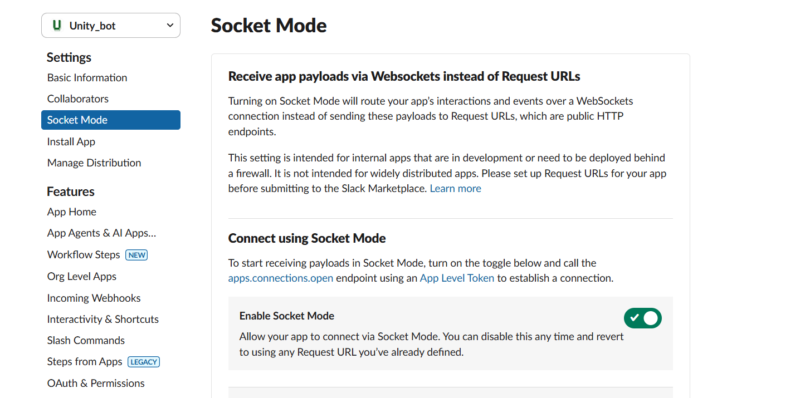

# 🔧 Slack App Setup Guide

This guide walks you through setting up a Slack app for the Unity Slack Lambda Bot using either a manifest file or manual configuration.

## 📋 Table of Contents

- [🚀 Quick Setup with Manifest (Recommended)](#-quick-setup-with-manifest-recommended)
- [🔧 Manual Setup](#-manual-setup)
- [🔑 Getting Required Tokens and Secrets](#-getting-required-tokens-and-secrets)
- [⚡ Configuring for Lambda Deployment](#-configuring-for-lambda-deployment)
- [🏠 Installing App to Workspace](#-installing-app-to-workspace)
- [✅ Testing Your Configuration](#-testing-your-configuration)
- [🔧 Troubleshooting](#-troubleshooting)

## 🚀 Quick Setup with Manifest (Recommended)

Using a manifest file is the fastest way to set up your Slack app with all the correct permissions and settings.

### Step 1: Create a New Slack App

1. **Go to Slack API website**: Visit [https://api.slack.com/apps](https://api.slack.com/apps)
2. **Click "Create New App"**


### Step 2: Select Your Workspace

Choose the workspace where you want to install the Unity bot. You'll see a list of all Slack workspaces you have access to.


### Step 3: Choose "From a manifest"

Select **"From a manifest"** to use a pre-configured setup. This option allows you to create an app with all the necessary permissions and settings already defined in a JSON file.


### Step 4: Select the Appropriate Manifest

Choose the manifest file based on your deployment method:

- **`docs/manifests/slackbot-lambda.json`** - For AWS Lambda deployment (recommended)
- **`docs/manifests/slackbot-ecs.json`** - For ECS deployment (optional)
- **`docs/manifests/slack-scraper-bot.json`** - For Slack scraper functionality

**For this guide, use the `slackbot-lambda.json` manifest** since we're focusing on Lambda deployment.

#### What's in the Lambda Manifest?

The Lambda manifest includes:

- **App Information**: Name "UnityBot" and description
- **Required Permissions**: All necessary OAuth scopes for Lambda deployment
- **Event Subscriptions**: Pre-configured for `app_mention` events
- **Socket Mode**: Disabled (correct for Lambda)
- **Bot User**: Configured to be always online

**Important**: The manifest includes a placeholder `request_url`. You'll need to update this with your actual API Gateway endpoint after deployment.

### Step 5: Create Your App

Review the manifest configuration and click **"Create"**. You'll see a preview of all the permissions and settings that will be configured for your app.


Your app will be created with all the necessary permissions and settings pre-configured! This includes OAuth scopes, event subscriptions, and bot user configuration.

## 🔧 Manual Setup

If you prefer to set up the app manually or need to understand each configuration step, follow the detailed manual setup in the sections below. However, using the manifest is recommended for consistency.

### Manual Configuration Steps

1. **Create app from scratch**
2. **Configure OAuth & Permissions** with required scopes
3. **Set up Event Subscriptions** with proper events
4. **Configure Slash Commands** (optional)

For detailed manual setup instructions, refer to the original comprehensive guide sections.

## 🔑 Getting Required Tokens and Secrets

After creating your app (either via manifest or manually), you need to collect the required tokens and secrets.

### 1. Signing Secret

The signing secret is used to verify that requests are coming from Slack.

1. **Navigate to "Basic Information"** in your app settings
2. **Scroll down to "App Credentials"**
3. **Click "Show" next to the Signing Secret**
4. **Copy the revealed signing secret**


**Save this as `SLACK_SIGNING_SECRET` in your GitHub secrets.**

### 2. App Token (For ECS/Socket Mode Only)

**Note**: App tokens are only needed for Socket Mode (ECS deployment). Skip this for Lambda deployment.

1. **In the same "Basic Information" section**
2. **Find "App-Level Tokens"**
3. **Generate a token** if one doesn't exist (click "Generate Token and Scopes")
4. **Copy the token** (starts with `xapp-`)


**Save this as `SLACK_APP_TOKEN` in your GitHub secrets** (only if using ECS deployment).

### 3. Bot Token

The bot token allows your app to perform actions in Slack.

1. **Navigate to "OAuth & Permissions"** in the left sidebar
2. **Scroll to the "OAuth Tokens for Your Workspace" section**
3. **Copy the "Bot User OAuth Token"** (starts with `xoxb-`)


**Save this as `SLACK_BOT_TOKEN` in your GitHub secrets.**

### 4. Socket Mode Configuration (ECS Only)

**Important**: Socket Mode is only for ECS deployment. For Lambda deployment, ensure Socket Mode is **OFF**.



- **For Lambda deployment**: Ensure Socket Mode is **disabled**
- **For ECS deployment**: Enable Socket Mode and generate an App Token

## ⚡ Configuring for Lambda Deployment

For AWS Lambda deployment, you need to configure Event Subscriptions with your API Gateway endpoint.

### Step 1: Deploy Your Lambda Function First

Before configuring Slack, you need to deploy your Lambda function to get the API Gateway endpoint:

```bash
# Deploy the Slack Lambda bot
git add .
git commit -m "Deploy Slack Lambda Bot"
git push origin main
```

### Step 2: Get the API Gateway Endpoint

After deployment, check the GitHub Actions output for the API Gateway endpoint URL. It will look like:

```
https://abc123def4.execute-api.us-east-1.amazonaws.com/prod/slack
```

### Step 3: Configure Event Subscriptions

1. **Navigate to "Event Subscriptions"** in your Slack app settings
2. **Toggle "Enable Events" to On**
3. **Enter your API Gateway endpoint** in the "Request URL" field
4. **Wait for verification** - Slack will send a challenge request to your endpoint
5. **Ensure bot events are configured** - you should see `app_mention` in the list


**Important Notes**:

- The URL must end with `/slack`
- It may not verify on the first try - click "Retry" if needed
- Your Lambda function must be deployed and working for verification to succeed

### Step 4: Update Manifest for Future Use (Optional)

If you used a manifest, you can update the `request_url` in the manifest file for future deployments:

1. **Open the manifest file**: `docs/manifests/slackbot-lambda.json`
2. **Find the `request_url` field**:
   ```json
   {
     "settings": {
       "event_subscriptions": {
         "request_url": "https://a4i4scsgfj.execute-api.us-east-1.amazonaws.com/prod/slack",
         "bot_events": ["app_mention"]
       }
     }
   }
   ```
3. **Replace with your API Gateway endpoint**:
   ```json
   "request_url": "https://your-api-gateway-id.execute-api.region.amazonaws.com/prod/slack"
   ```
4. **Save the file** for future app creations

This way, future Slack apps created with this manifest will have the correct endpoint pre-configured.

## 🏠 Installing App to Workspace

### Install the App

1. **Navigate to "OAuth & Permissions"**
2. **Click "Install to Workspace"**
3. **Review the permissions** and click "Allow"

The bot should now appear in your workspace's Apps section.

### Add Bot to Channels

For the bot to respond in channels, you need to add it:

1. **Go to the desired channel**
2. **Type `/invite @YourBotName`** or use the channel settings
3. **The bot will now be able to read and respond to messages in that channel**

## ✅ Testing Your Configuration

### Test Checklist

- [ ] **Bot appears in workspace**: Check the Apps section
- [ ] **Event Subscriptions verified**: Green checkmark in Slack app settings
- [ ] **Bot responds to DMs**: Send a direct message
- [ ] **Bot responds to mentions**: Mention the bot in a channel
- [ ] **API Gateway logs**: Check CloudWatch logs for incoming requests

### Test Commands

```bash
# Test direct message
Hello, can you help me with Unity documentation?

# Test channel mention
@YourBotName What is Unity?

# Test in a channel where bot is added
@YourBotName How do I create a GameObject?
```

### Verify in AWS

```bash
# Check Lambda function logs
aws logs tail /aws/lambda/unity-slack-lambda --follow

# Check API Gateway access logs
aws logs tail /aws/apigateway/unity-slack-api --follow
```

## 🔧 Troubleshooting

### ⚠️ Common Issues

#### 1. **Event Subscriptions URL Verification Failed**

**Symptoms**: Red X next to Request URL, "Verification failed" message

**Solutions**:

- Ensure your Lambda function is deployed and running
- Check that the URL ends with `/slack`
- Verify the Lambda function has proper permissions
- Try clicking "Retry" - it sometimes works on the second attempt
- Check CloudWatch logs for Lambda errors

#### 2. **Bot Not Responding**

**Symptoms**: Bot appears online but doesn't respond to messages

**Solutions**:

- Verify Event Subscriptions are properly configured
- Check that the bot has been added to the channel
- Ensure all required bot scopes are granted
- Check CloudWatch logs for errors
- Verify the API Gateway endpoint is accessible

#### 3. **Permission Errors**

**Symptoms**: Bot responds with permission-related errors

**Solutions**:

- Reinstall the app to workspace after changing scopes
- Verify all required OAuth scopes are added
- Check that the bot token is correctly set in GitHub secrets

#### 4. **Socket Mode Issues (ECS Only)**

**Symptoms**: ECS bot not connecting or frequent disconnections

**Solutions**:

- Ensure Socket Mode is enabled
- Verify App Token is correctly configured
- Check ECS task logs for connection errors
- Ensure proper network configuration for ECS

### 🔍 Debugging Steps

1. **Check Slack App Event Logs**:

   - Go to your Slack app settings
   - Navigate to "Event Subscriptions"
   - Check the "Request URL" section for delivery attempts

2. **Monitor AWS CloudWatch**:

   ```bash
   # Real-time Lambda logs
   aws logs tail /aws/lambda/unity-slack-lambda --follow

   # Check recent errors
   aws logs filter-log-events \
     --log-group-name /aws/lambda/unity-slack-lambda \
     --filter-pattern "ERROR"
   ```

3. **Test API Gateway Directly**:
   ```bash
   # Test if endpoint is accessible
   curl -X POST https://your-api-gateway-id.execute-api.region.amazonaws.com/prod/slack \
     -H "Content-Type: application/json" \
     -d '{"type": "url_verification", "challenge": "test"}'
   ```

### 📝 Configuration Checklist

- [ ] **Slack App Created**: Using manifest or manual setup
- [ ] **Signing Secret**: Added to GitHub secrets as `SLACK_SIGNING_SECRET`
- [ ] **Bot Token**: Added to GitHub secrets as `SLACK_BOT_TOKEN`
- [ ] **Lambda Deployed**: API Gateway endpoint available
- [ ] **Event Subscriptions**: Configured with API Gateway URL
- [ ] **Socket Mode**: Disabled for Lambda, enabled for ECS
- [ ] **App Installed**: To workspace with proper permissions
- [ ] **Bot Added**: To desired channels
- [ ] **Testing**: Bot responds to messages and mentions

---

## 📚 Additional Resources

- [Slack API Documentation](https://api.slack.com/)
- [Slack App Manifests](https://api.slack.com/reference/manifests)
- [Event Subscriptions Guide](https://api.slack.com/events-api)
- [OAuth Scopes Reference](https://api.slack.com/scopes)
- [AWS Lambda Documentation](https://docs.aws.amazon.com/lambda/)

## 🔄 Next Steps

After completing this setup:

1. **Deploy your Lambda functions** using the [Deployment Guide](README-DEPLOYMENT.md)
2. **Set up your Knowledge Base** following the [Knowledge Base Setup Guide](KNOWLEDGE-BASE-SETUP.md)
3. **Test the complete system** with real Unity documentation queries
4. **Monitor and optimize** based on usage patterns
